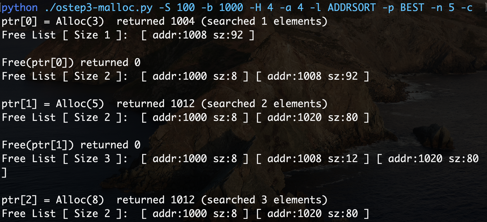
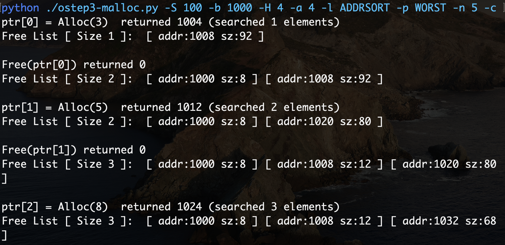

#### 最先匹配

1. 申请一块3字节的空间，则返回地址1004，剩余一块可用的92字节的空间。
2. 释放先前申请的空间，则剩余一块可用的8字节的空间和一块可用的92字节的空间。
3. 申请一块5字节的空间，在最先匹配的策略下，按照地址从前向后搜索，第一块空间大小不够（$4<5$），第二块空间大小充足（$5<88$），则返回地址1012，剩余一块可用的8字节的空间和一块可用的80字节的空间。
4. 释放先前申请的空间，则剩余一块可用的8字节的空间，一块可用的12字节的空间和一块可用的80字节的空间。
5. 申请一块8字节的空间，在最先匹配的策略下，按照地址从前向后搜索，第一块空间大小不够（$4<5$），第二块空间大小充足（$8=8$），则返回地址1012，剩余一块可用的8字节的空间和一块可用的80字节的空间。

#### 最佳匹配

1. 申请一块3字节的空间，则返回地址1004，剩余一块可用的92字节的空间。
2. 释放先前申请的空间，则剩余一块可用的8字节的空间和一块可用的92字节的空间。
3. 申请一块5字节的空间，在最佳匹配的策略下，按照可用空间大小从小到大搜索，第一块空间大小不够（$4<5$），第二块空间大小充足（$5<88$），则返回地址1012，剩余一块可用的8字节的空间和一块可用的80字节的空间。
4. 释放先前申请的空间，则剩余一块可用的8字节的空间，一块可用的12字节的空间和一块可用的80字节的空间。
5. 申请一块8字节的空间，在最佳匹配的策略下，按照可用空间大小从小到大搜索，第一块空间大小不够（$4<5$），第二块空间大小充足（$8=8$），则返回地址1012，剩余一块可用的8字节的空间和一块可用的80字节的空间。

#### 最差匹配

1. 申请一块3字节的空间，则返回地址1004，剩余一块可用的92字节的空间。
2. 释放先前申请的空间，则剩余一块可用的8字节的空间和一块可用的92字节的空间。
3. 申请一块5字节的空间，在最差匹配的策略下，按照可用空间大小从大到小搜索，第一块空间大小充足（$88>5$），则返回地址1012，剩余一块可用的8字节的空间和一块可用的80字节的空间。
4. 释放先前申请的空间，则剩余一块可用的8字节的空间，一块可用的12字节的空间和一块可用的80字节的空间。
5. 申请一块8字节的空间，在最差匹配的策略下，按照可用空间大小从大到小搜索，第一块空间大小充足（$76>8$），则返回地址1024，剩余一块可用的8字节的空间，一块可用的12字节的空间和一块可用的68字节的空间。

