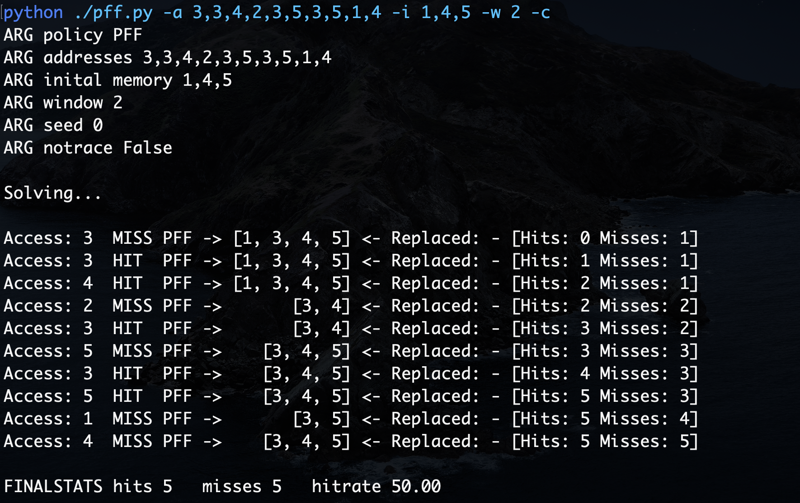
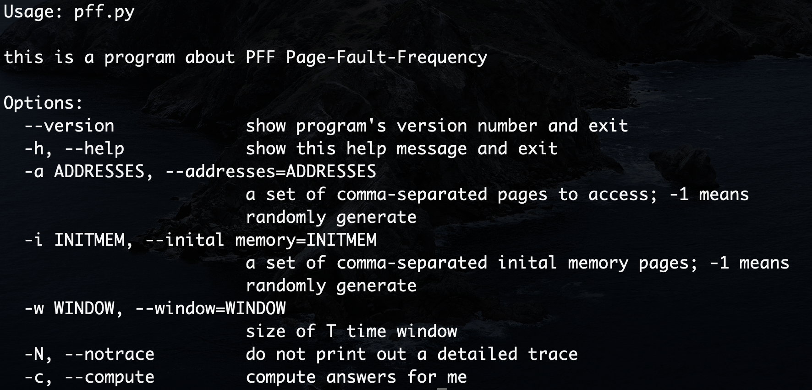

# 第八次课后作业

> 张祎维 2017013640 计71

- [ ] 实现的算法&emsp;&emsp;&emsp;&emsp;&emsp;&emsp;&emsp;&emsp;&emsp;&emsp;缺页率置换算法`PFF`
- [ ] 使用的语言&emsp;&emsp;&emsp;&emsp;&emsp;&emsp;&emsp;&emsp;&emsp;&emsp;`python`
- [ ] 程序代码&emsp;&emsp;&emsp;&emsp;&emsp;&emsp;&emsp;&emsp;&emsp;&emsp;&emsp;`pff.py`
- [ ] 参考了示例`page-replacement-policy.py`代码

#### 测试样例

访问页面

```bash
3, 3, 4, 2, 3, 5, 3, 5, 1, 4
```

初始逻辑页面

```bash
1, 4, 5
```

时间间隔`T`(串口大小)

```bash
2
```

#### 测试结果



#### 代码参数说明



